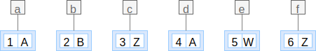
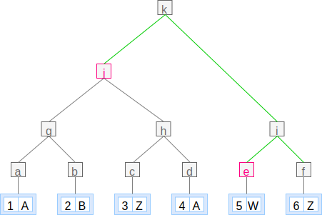

The mechanism for proving the integrity of a Register is based on the digital
proofs defined by the [Certificate Transparency](@rfc6962) data structures
(section 1.2) and cryptographic components (section 2).

Proving the integrity of a Register allows a user to verify the data they have
was genuinely created by the Register custodian of the Register. In other
words, it helps auditing if the Register has been tampered with.

***
NOTE: You may read the [suggested readings](/introduction#suggested-readings)
to acquaint yourself with the topic.
***

Verifiable data structures are all applications of a Merkle tree, which enable
to efficiently prove to the user that certain properties of registers are
obeyed. The root hash of each Merkle tree is also signed to provide guarantees
of provenance.

***
**EXAMPLE:**

For example, these are the steps to generate an Audit path.
Given a log `[(1, "A"), (2, "B"), (3, "Z"), (4, "A"), (5, "W"), (6, "Z")]`:


From the list of entries we have to build a Merkle tree, so the first step is
to hash each entry with a hashing function. E.g. `a = h (1, "A")`, `c = h (3, "Z")`.



Then we pair the resulting hashes, concatenate them and hash the result. E.g.
`g = h (concat a b)`.


And we repeat the procedure for the resulting list of hashes.


The Audit path to proof entry `(6, "Z")` is `[j, e]` given that these are the
minimum set of hashes required to compute `k`, the Merkle root hash.



Similarly, the audit paths for the rest of entries are as follow:

```elm
audit_path (1, "A") log == [b, h, i]
audit_path (2, "B") log == [a, h, i]
audit_path (3, "Z") log == [g, d, i]
audit_path (4, "A") log == [g, c, i]
audit_path (5, "W") log == [j, f]
audit_path (6, "Z") log == [j, e]
```

***


## Digital proofs

There are a few types of [digital proofs](/glossary/digital-proof/), each one
of them supports proving a different trait on a Register. The “Register proof”
to [verify the register](#register-verification), the “Entry proof” to [verify
an entry in the log](#entry-verification) and the “Consistency proof” to [verify
that two registers of different sizes are consistent](#consistency-verification).


## Register verification

The Register verification process allows proving that a copy of a Register is
exactly the same as the original one.

***
TODO: Define and link “root hash” (and Merkle tree).
***

A client MUST be able to do the following:

1. Get a copy of a Register (i.e. Entries and Items).
2. Get the Register proof.
   and items?
3. Compute the root hash the log of entries.
4. Sign the root hash with the Register public key.
5. Verify the root hash is the same as the root hash part of the Register
   proof.
6. Verify the signed root hash is the same as the [signed root
   hash](#signed-tree-head) part of the Register proof.
7. Verify that for each Item hash in each Entry there is an Item.
8. Verify that each Item computes the same hash that identifies it.

***
TODO: Can (2) be obtained atomically with (1)?
***

***
TODO: Isn't (5) implied if (6) succeeds?
***

***
TODO: The reference implementation doesn't provide signatures nor public keys.
How does this affect our planning to align spec and impl?
***

***
TODO: How does (7) work with “Redaction by blob removal”?
***


## Entry verification

The Entry verification process allows proving that a copy of an entry exists in
the (original) Register.

A client MUST be able to do the following:

1. Given a copy of an entry,
2. and the log size (total number of entries).
3. Get the Entry proof for the log size.
4. Compute the root hash from the Entry and the audit path.
5. Verify the root hash is the same as the root hash found in the Entry proof.
6. Verify the signed root hash is the same as the [signed root
   hash](#signed-tree-head) found in the Entry proof.

***
TODO: (4) Define “audit path” or “merkle audit path”.
***

***
TODO: Clarify what is actually need in terms of (2) and why the original
explanation requires a register proof log size.
***

***
TODO: Reubicate

The merkle-audit-path for the entry from the Entry proof resource provides the
shortest list of additional nodes in the Merkle tree required to compute the
Merkle tree root hash.
***


## Consistency verification

The Consistency verification process allows proving that a Register copy is a
subset of a larger Register.

A client MUST be able to do the following:

1. Given a Register copy.
2. Get the Consistency proof from the original Register.
3. Compute the larger root hash from the Register copy and the audit path.
4. Compute the smaller root hash from the Register copy and the consistency
   nodes.
5. Verify the larger root hash is the same as the root hash found in the
   Consistency proof.
6. Verify the smaller root hash is the same as the root hash found in the
   Consistency proof.
6. Verify the signed larger root hash is the same as the [signed root
   hash](#signed-tree-head) found in the Consistency proof.

***
TODO: merkle-consistency-nodes vs merkle-audit-path? Define both.
***

***
TODO: Review the steps to clarify the mechanism for (5) and (6)
***


## Signed tree head

***
TODO: Move elsewhere
***

The signed tree head for a register is the tree-head-signature property of the
[Register proof](/glossary/digital-proof#register-proof), where the `proof-identifier` is
specified as `merkle:sha-256`.

The signed tree head for a register is the signed Merkle tree root hash
([RFC6962](@rfc6962) section 2.1) of a Merkle tree containing all entries
in the register. The corresponding root-hash is also a property of the
[Register proof](/glossary/digital-proof#register-proof).


## Compromised proof

***
ISSUE: Is this out of scope? What does it entail?
***

## Compromised private key

***
ISSUE: Is this out of scope? What does it entail?
***
