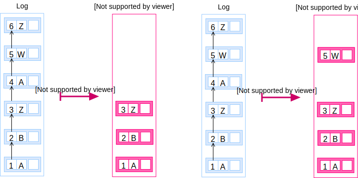

A **version** of the dataset is a [snapshot](/glossary/snapshot) at a
particular point in the [log](/glossary/log) of changes. There is no specific
**version** identifier although the [entry number](/glossary/entry#number)
used to set the log size to compute the snapshot can act as such.

The latest version is the [list of records](/glossary/record).

Data can be sliced in a different way to collect all versions for a particular
element, the [trail](/glossary/trail).

