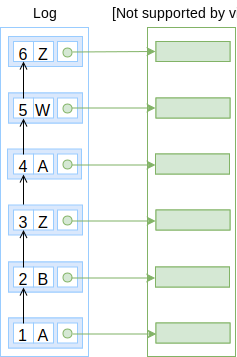

A **log** of changes is a sequence of entries identified by
their numerical order, the [entry number](/glossary/entry#number).
It is the backbone data structure that enables [snapshots](/glossary/snapshot),
[records](/glossary/record) and [audit](/data-model/audit).


```elm
type Log =
  List Entry
```




## Operations

_This section is non-normative._

Conceptually, a log has a few operations to help interact with it and with the
rest of the [data model](/data-model).


A log is a list of immutable [entries](/glossary/entry) so in order to evolve
the log the main operation is to `append` a new entry to it.

```elm
append : Entry -> Log -> Log
```

The log needs to be consumed at different sizes to support functionality like
[snapshots](/glossary/snapshots).

```elm
take : Integer -> Log -> Log
```

And finally, obtaining discrete entries from the log is as important and
supported by the [REST API](/rest-api).

```elm
get : ID -> Log -> Maybe Entry
```
