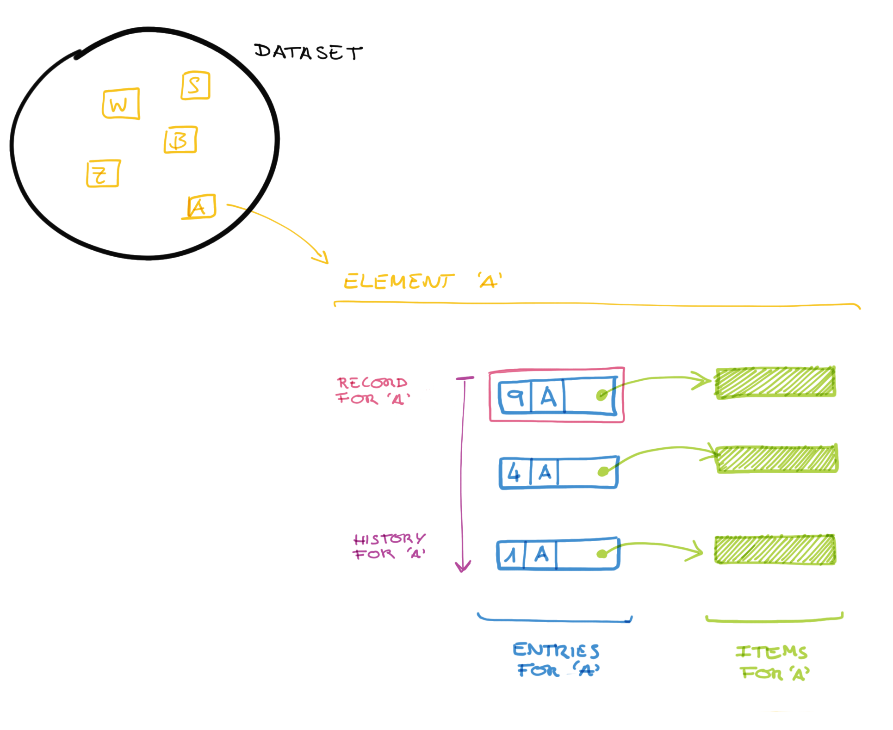

***
TODO: If a record is an entry, I want a resource for the latest data for a
given key, with no metadata in it.
***

A record is an element of the latest [snapshot](/glossary#snapshot). It can be
computed from the [log](/glossary#log) by a similar method of computing a
snapshot.

```elm
record : Key -> Log -> Maybe Entry
```

The algorithm:

1. Let _key_ be the identifier for the record to find.
1. Let _log_ be the full log to parse.
1. Let _result_ be empty.
1. Foreach _entry_ in the _log_:
    1. If the _entry_ key equals the _key_, store it in _result_.

       Otherwise, do nothing.

After all entries in the log have been inspected, the latest one stored in
_result_ is the record. If no entries were found for _key_, the record doesn't
exist in the Register.

***
NOTE: The reference implementation inlines the [Item](/glossary/item/) in the
[Record resource](/rest-api/records/) for convenience.
***

***
TODO: Is the above note normative or, what are the true expectations we want
to set for consuming records?
***

Similarly, you can filter the [log](/glossary/log/) to get the trail of
changes for an element, given its key:

```elm
trail : Key -> Log -> List Entry
```



***
**EXAMPLE:**

For example, given a log:

```elm
log =
  [ Entry
     { number : 1
     , key: Key "A"
     ...
     }
  , Entry
     { number : 2
     , key: Key "B"
     ...
     }
  , Entry
     { number : 3
     , key: Key "Z"
     ...
     }
  , Entry
     { number : 4
     , key: Key "A"
     ...
     }
  , Entry
     { number : 5
     , key: Key "Z"
     ...
     }
  ]
```

The trail for element “A” is:

```elm
trail (Key "A") log == [ Entry
                          { number : 1
                          , key: Key "A"
                          ...
                          }
                       , Entry
                          { number : 4
                          , key: Key "A"
                          ...
                          }
                       ]
```

And the record:

```elm
record (Key "A") log == Entry
                          { number : 4
                          , key: Key "A"
                          ...
                          }
```
***
