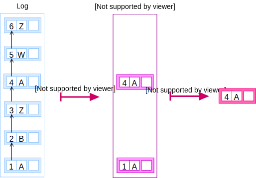

A **trail** is the list of [entries](/glossary/entry) for a given key. It
represents the history of changes for a given key.

```elm
type Trail =
  List Entry
```

A trail can be seen as a function `filterBy` that derives from a given
[log](/glossary/log):

```elm
filterBy : ID -> Log -> Maybe Trail
```

Similar to the [snapshot](/glossary/snapshot), there is a function to get the
[record](/glossary/record) from the **trail**:

```elm
record : Trail -> Entry
```



***
**EXAMPLE:**

For example, given a log:

```elm
log =
  [ Entry
     { number : 1
     , key: ID "A"
     ...
     }
  , Entry
     { number : 2
     , key: ID "B"
     ...
     }
  , Entry
     { number : 3
     , key: ID "Z"
     ...
     }
  , Entry
     { number : 4
     , key: ID "A"
     ...
     }
  , Entry
     { number : 5
     , key: ID "Z"
     ...
     }
  ]
```

The trail for element “A” is:

```elm
filterBy (ID "A") log == Just Trail
                          [ Entry
                            { number : 1
                            , key: ID "A"
                            ...
                            }
                         , Entry
                            { number : 4
                            , key: ID "A"
                            ...
                            }
                         ]
```

And the record:

```elm
record (ID "A") log == Just Entry
                          { number : 4
                          , key: ID "A"
                          ...
                          }
```
***
