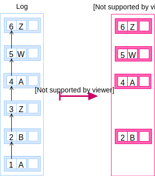

A Register is an unordered dataset of elements of a single type of _thing_
with the ability to provide previous versions for the elements held in it. The
dataset can be mapped to any of the [serialisation
formats](/v1/rest-api#serialisation) defined in this specification and it can be
published over HTTP as a [REST API](/v1/rest-api).

The backbone data structure is the [**log**](/v1/glossary/log) of changes. It is
a sequence of entries identified by their numerical order, the [entry
number](/v1/glossary/entry#number).

Each [entry](/v1/glossary/entry) defines a change for an element in the dataset
by recording the time the change was appended to the log, the numerical order
in the log, the key to identify the element the change is for and the
reference to the [data for that element](/v1/glossary/item).


A [snapshot](/v1/glossary/snapshot) of the state of the Register can be collected
from the log. When the snapshot is the latest one, the elements are called
[records](/v1/glossary/record).




A Register uses a sidecar data structure derived from the **log** that allows
anyone to efficiently audit the integrity of the data held in it. This data
structure is a [Merkle tree](https://en.wikipedia.org/wiki/Merkle_tree) as
described by the Certificate Transparency [RFC6962](@rfc6962). Check the
[Audit section](/v1/data-model/audit) for details.

In summary, the **log** and all its parts form an immutable data structure that
allow expressing a sequence of changes on the dataset of elements, the
Register.


## Audit

The mechanism for proving the integrity of a Register is based on the digital
proofs defined by the [Certificate Transparency](@rfc6962) data structures
(section 1.2) and cryptographic components (section 2).

Proving the integrity of a Register allows a user to verify the data they have
was genuinely created by the Register custodian of the Register. In other
words, it helps auditing if the Register has been tampered with.

***
NOTE: You may read the [suggested readings](/v1/introduction#suggested-readings)
to acquaint yourself with the topic.
***

Verifiable data structures are all applications of a Merkle tree, which enable
to efficiently prove to the user that certain properties of registers are
obeyed. The root hash of each Merkle tree is also signed to provide guarantees
of provenance.

## Link

The mechanism for linking two elements is the [CURIE datatype](/v1/datatypes/curie).
It allows linking between registers defined in the same [catalogue](/v1/glossary/catalogue).

The catalogue serves as the lookup table for prefix mappings. Given a CURIE
prefix, the catalogue should return its base URL such that the user could
perform [the expansion to a URL](/v1/datatypes/curie#expansion-to-url).

***
**EXAMPLE:**

For example, a link to the country of birth could be expressed as:

```elm
[ ("name", "Alan Turing")
, ("born-in", "country:GB")
]
```

Or a link of an allergen to its group which is part of the same dataset:

```elm
[ ("name", "Walnut")
, ("group", "allergen:24")
]
```
***

## Backwards compitability

Backwards compitability requires that once a [data
attribute](/v1/glossary/attribute) is introduced its semantics don't change.


## Forwards compatibility

Forwards compatibility requires that tools consuming a register MUST apply the
“must-ignore” rule for unknown attributes and assume that a missing known
attribute is a missing value.

A missing value for a known attribute MUST be treated as the canonical form
for an empty value (i.e. empty string for cardinality 1 or empty set for
cardinality n).

***
**EXAMPLE:**

For example, given a schema such as:

```elm
Schema
  [ Attribute { id = "name", datatype = One String, ... }
  , Attribute { id = "start-date", datatype = One Datetime, ... }
  , Attribute { id = "end-date", datatype = One Datetime, ... }
  ]
```

When given a data blob such as:

```elm
Item
  [ ("name", "Walnut")
  , ("group", "allergen:24")
  ]
```

The “must-ignore” rule applies by ignoring the unknown `group` datum:

```elm
Allergen
  { id = ID "32"
  , name = Just "Foo"
  , startDate = Nothing
  , endDate = Nothing
  }
```


When instead, the data blob is:

```elm
Item
  [ ("name", "foo")
  , ("start-date", "2018-08-14")
  ]
```

The “missing-value” rule applies to `end-date`; a consumer must assume the
value for `end-date` is _unknown_ and as such the follwing data blob is
isomorphic:


```elm
Item
  [ ("name", "Foo")
  , ("start-date", "2018-08-14")
  , ("end-date", "")
  ]
```

And when applying the schema, it can be seen as:

```elm
Allergen
  { id = ID "32"
  , name = Just "Foo"
  , startDate = Just (Datetime 2018 8 14)
  , endDate = Nothing
  }
```

In other words, the `Allergen` type would be defined with all its attributes
as optional:

```elm
type Allergen
  { id : ID
  , name : Maybe String
  , startDate : Maybe Datetime
  , endDate : Maybe Datetime
  }
```

***
