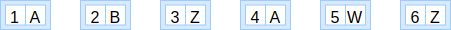
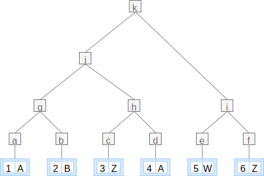

The mechanism for proving the integrity of a Register is based on the digital
proofs defined by the [Certificate Transparency](@rfc6962) data structures
(section 1.2) and cryptographic components (section 2).

Proving the integrity of a Register allows a user to verify the data they have
was genuinely created by the Register custodian of the Register. In other
words, it helps auditing if the Register has been tampered with.

***
NOTE: You may read the [suggested readings](/introduction#suggested-readings)
to acquaint yourself with the topic.
***

Verifiable data structures are all applications of a Merkle tree, which enable
to efficiently prove to the user that certain properties of registers are
obeyed. The root hash of each Merkle tree is also signed to provide guarantees
of provenance.

***
**EXAMPLE:**

For example, these are the steps to generate an Audit path.
Given a log `[(1, "A"), (2, "B"), (3, "Z"), (4, "A"), (5, "W"), (6, "Z")]`:



From the list of entries we have to build a Merkle tree, so the first step is
to hash each entry with a hashing function. E.g. `a = h (1, "A")`, `c = h (3, "Z")`.


Then we pair the resulting hashes, concatenate them and hash the result. E.g.
`g = h (concat a b)`.


And we repeat the procedure for the resulting list of hashes.



The Audit path to proof entry `(6, "Z")` is `[j, e]` given that these are the
minimum set of hashes required to compute `k`, the Merkle root hash.


Similarly, the audit paths for the rest of entries are as follow:

```elm
audit_path (1, "A") log == [b, h, i]
audit_path (2, "B") log == [a, h, i]
audit_path (3, "Z") log == [g, d, i]
audit_path (4, "A") log == [g, c, i]
audit_path (5, "W") log == [j, f]
audit_path (6, "Z") log == [j, e]
```

***


## Digital proofs

There are a few types of [digital proofs](/glossary/digital-proof), each one
of them supports proving a different trait on a Register. The “Register proof”
to [verify the register](#register-verification), the “Entry proof” to [verify
an entry in the log](#entry-verification) and the “Consistency proof” to [verify
that two registers of different sizes are consistent](#consistency-verification).


***
NOTE: The reference implementation doesn't provide signatures just yet.
***

## Register verification

The Register verification process allows proving that a copy of a Register is
exactly the same as the original one.

A client MUST be able to do the following:

1. Get a copy of the Register (i.e. entries, blobs and register proof).
2. Compute the [root hash](/glossary/digital-proof#root-hash) for the log of entries.
3. Sign the root hash with the Register public key.
4. Verify the root hash is the same as the root hash part of the Register
   proof.
5. Verify the signed root hash is the same as the [signed root
   hash](#signed-tree-head) part of the Register proof.
6. Verify that for each Blob hash in each Entry there is an Blob.
7. Verify that each Blob computes the same hash that identifies it.


## Consistency verification

The Consistency verification process allows proving that a Register _S_ is a
subset of a larger Register _L_.

A client MUST be able to do the following:

1. Given a Register of size _S_ and a root hash _R_ for a register of size _L_.
2. [Verify the original register](#register-verification) has the root hash _R_.
3. Get the Consistency proof (from _S_ to _L_) from the original Register.
4. Compute the [root hash](/glossary/digital-proof#root-hash) using the [audit path](/glossary/digital-proof#audit-path)
   using the Register _S_ and the audit path from the Consistency proof.
5. Verify the resulting root hash is the same as _R_.


## Entry verification

The Entry verification process allows proving that a copy of an entry exists in
the original Register.

A client MUST be able to do the following:

1. Given a copy of an [entry](/glossary/entry),
2. and the log size (total number of entries).
3. Get the [Entry proof](/glossary/digital-proof#entry-proof) for the log size.
4. Compute the root hash from the Entry and the [audit path](/glossary/digital-proof#audit-path).
5. Verify the [root hash](/glossary/digital-proof#root-hash) is the same as the root hash found in the Entry proof.
6. Verify the signed root hash is the same as the [signed root
   hash](/glossary/digital-proof#signed-tree-head) found in the Entry proof.
